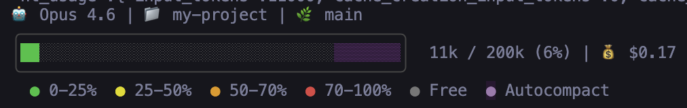
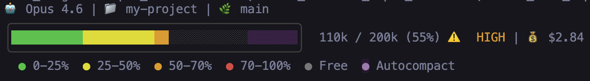
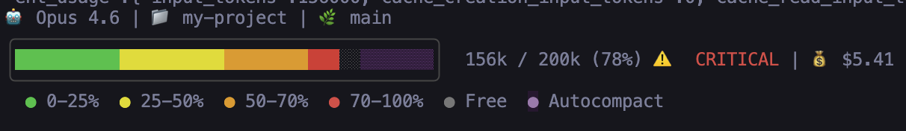

# claude-code-statusbar

A rich status bar for [Claude Code](https://docs.anthropic.com/en/docs/claude-code) that displays real-time session info directly in your terminal.

### Low usage (6%)


### Medium usage (55%) — HIGH warning


### High usage (78%) — CRITICAL warning


## What it shows

**Line 1 — Session info:**
- Current model name
- Working directory / repo name
- Git branch with staged (+) and modified (~) file counts

**Lines 2-5 — Context window usage:**
- Color-coded progress bar that shifts from green to red as context fills up
- Token count (used / total) with percentage
- Warning indicators at 50% (HIGH) and 70% (CRITICAL)
- Visual autocompact buffer zone (~16.5% of context reserved for autocompaction)
- Session cost in USD

## Installation

1. **Copy the script** to your Claude config directory:

   ```bash
   cp statusline.py ~/.claude/statusline.py
   chmod +x ~/.claude/statusline.py
   ```

2. **Configure Claude Code** — add this to `~/.claude/settings.json`:

   ```json
   {
     "statusLine": {
       "type": "command",
       "command": "~/.claude/statusline.py",
       "padding": 1
     }
   }
   ```

3. **Restart Claude Code** — the status bar will appear at the bottom of your terminal.

## Try it out

You can preview the status bar by piping sample JSON into the script:

```bash
echo '{"model":{"display_name":"Opus 4.6"},"workspace":{"current_dir":"/home/user/my-project"},"cost":{"total_cost_usd":0.42},"context_window":{"used_percentage":18,"context_window_size":200000,"current_usage":{"input_tokens":36000,"cache_creation_input_tokens":0,"cache_read_input_tokens":0}}}' | python3 statusline.py
```

Change `used_percentage` and `input_tokens` to see different states (try 55 for HIGH warning, 78 for CRITICAL).

## Requirements

- Python 3.6+
- A terminal with true-color (24-bit) support (most modern terminals)
- Git (for branch/status info — gracefully degrades if not in a repo)

## How it works

Claude Code's `statusLine` setting pipes session data (model, context window stats, cost, etc.) as JSON to stdin of the configured command. This script reads that JSON and renders a multi-line status bar with ANSI escape codes for colors.

The autocompact zone represents the portion of the context window that Claude Code reserves for automatic conversation compaction — when usage reaches this zone, older messages get compressed to free up space.

## License

MIT
